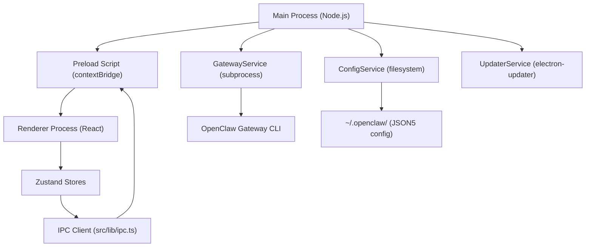
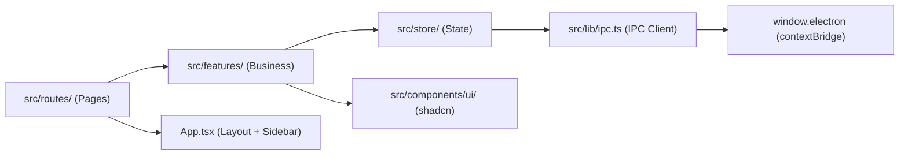

# ClawUI Development Guide (Agent)

本文档为 AI Agent 在 ClawUI (OpenClaw Desktop App) 仓库中工作提供指导。这是一个 Electron 桌面应用，为 OpenClaw AI 网关提供图形界面。

**重要约定：请使用中文回答所有问题。**

## Project Overview

ClawUI is an OpenClaw Desktop Application built with Electron, providing:
- Easy-to-use AI assistant interface (Chat)
- Multi-model support (BYOK / Subscription)
- Messaging channel integration (Telegram/Discord/WhatsApp/Slack)
- MCP tool management and permissions
- Plugin system via ClawHub
- Scheduled tasks (cron-based automation)
- Auto-updates via electron-updater

## Tech Stack

- **Desktop Framework**: Electron 33 + electron-vite
- **Frontend**: React 19 + React Router 7 + Tailwind CSS 4
- **UI Components**: shadcn/ui
- **State Management**: Zustand 5 (LobeChat Action layered pattern)
- **Icons**: Lucide React
- **Local Storage**: OpenClaw native filesystem (~/.openclaw/)
- **Auto Update**: electron-updater
- **Testing**: Vitest
- **Package Manager**: pnpm

## Architecture Diagram

### Electron Process Architecture



### Frontend Layer Architecture



## Directory Structure

```
ClawUI/
├── electron/                 # Electron main process
│   ├── main/
│   │   ├── index.ts         # Entry point, window creation
│   │   ├── ipc/             # IPC handlers
│   │   │   ├── app.ts       # App lifecycle handlers
│   │   │   ├── config.ts    # Config read/write handlers
│   │   │   └── gateway.ts   # Gateway start/stop handlers
│   │   └── services/        # Main process services
│   │       ├── config.ts    # ConfigService (filesystem)
│   │       ├── gateway.ts   # GatewayService (subprocess)
│   │       └── updater.ts   # UpdaterService (auto-update)
│   └── preload/
│       └── index.ts         # Context bridge (exposes `window.electron`)
├── src/                      # Renderer process (React)
│   ├── App.tsx              # Root layout + sidebar navigation
│   ├── main.tsx             # React entry point
│   ├── index.css            # Tailwind + CSS variables
│   ├── components/
│   │   └── ui/              # shadcn/ui components (Button, Card, etc.)
│   ├── features/            # Feature modules (business logic + UI)
│   │   ├── Chat/            # Chat interface
│   │   ├── Channels/        # Channel configuration
│   │   ├── Tools/           # Tool management
│   │   ├── MCP/             # MCP server configuration
│   │   ├── Plugins/         # Plugin marketplace
│   │   ├── Scheduler/       # Cron job management
│   │   ├── Settings/        # App settings
│   │   └── Subscription/    # Subscription management
│   ├── routes/              # Page components (React Router)
│   │   ├── page.tsx         # Chat page (/)
│   │   ├── channels/        # /channels
│   │   ├── tools/           # /tools
│   │   ├── mcp/             # /mcp
│   │   ├── plugins/         # /plugins
│   │   ├── scheduler/       # /scheduler
│   │   └── settings/        # /settings
│   ├── store/               # Zustand stores
│   │   ├── chat/            # Chat sessions & messages
│   │   ├── gateway/         # Gateway status
│   │   └── channels/        # Channel configurations
│   ├── hooks/               # React hooks
│   └── lib/
│       ├── ipc.ts           # Type-safe IPC client
│       └── utils.ts         # Utility functions (cn, etc.)
├── resources/               # App resources (icons, etc.)
├── package.json
├── electron.vite.config.ts  # electron-vite configuration
├── electron-builder.yml     # Build configuration
├── tailwind.config.js       # Tailwind CSS configuration
└── tsconfig.json
```

## Development Commands

### 常用命令

```bash
# 安装依赖
pnpm install

# 开发模式（Electron + HMR 热更新）
pnpm dev

# 生产构建
pnpm build

# 平台特定构建
pnpm build:mac        # macOS (.dmg)
pnpm build:win        # Windows (.exe)
pnpm build:linux      # Linux (.AppImage)
pnpm build:unpack     # 解压版本（用于测试）

# 类型检查（修改代码后必须运行）
bun run type-check

# 代码检查
pnpm lint             # ESLint 检查
pnpm lint:fix         # ESLint 自动修复

# 样式检查
pnpm stylelint        # Stylelint 检查 CSS
pnpm stylelint:fix    # Stylelint 自动修复

# 代码格式化
pnpm prettier         # Prettier 格式化

# 文档同步
pnpm sync-docs        # 同步 CLAUDE.md 和 AGENTS.md
```

### 测试命令

```bash
# 运行指定测试文件（必须使用路径过滤）
bunx vitest run --silent='passed-only' 'src/store/chat/index.test.ts'

# 运行匹配模式的测试
bunx vitest run --silent='passed-only' 'src/features/**/**.test.tsx'

# 运行单个测试并查看详情
bunx vitest run 'src/[file-path].test.ts' --reporter=verbose
```

### shadcn/ui 组件管理

```bash
# 添加新组件
npx shadcn@latest add button
npx shadcn@latest add dialog
npx shadcn@latest add dropdown-menu

# 查看可用组件
npx shadcn@latest add --help
```

### Skills 管理

```bash
# 搜索 skills
npx skills search <keyword>

# 安装 skill（全局）
npx skills add <owner/repo@skill> -y -g

# 示例
npx skills add jezweb/claude-skills@tailwind-patterns -y -g
npx skills add vercel-labs/agent-skills@v0-patterns -y -g
```

## Code Architecture

### Electron IPC Communication

Main ↔ Renderer communication uses contextBridge + ipcMain:

```typescript
// Preload (electron/preload/index.ts) - exposes API
contextBridge.exposeInMainWorld('electron', {
  gateway: {
    start: () => ipcRenderer.invoke('gateway:start'),
    stop: () => ipcRenderer.invoke('gateway:stop'),
    getStatus: () => ipcRenderer.invoke('gateway:status'),
    onStatusChange: (callback) => {
      ipcRenderer.on('gateway:status-changed', (_, status) => callback(status))
    },
  },
  config: { /* ... */ },
  app: { /* ... */ },
})

// Main (electron/main/ipc/*.ts) - handles requests
ipcMain.handle('gateway:start', async () => {
  await gatewayService.start()
})

// Renderer (src/lib/ipc.ts) - typed client
export const ipc = {
  gateway: {
    async start() {
      const api = getElectronAPI()
      if (api) await api.gateway.start()
    },
  },
}
```

### IPC Channel Naming Convention

- `gateway:*` - Gateway lifecycle (start/stop/status)
- `config:*` - Configuration read/write
- `subscription:*` - Subscription management
- `app:*` - App lifecycle (version/update/window controls)

### Main Process Services

| Service | Purpose | File |
|---------|---------|------|
| GatewayService | Manages OpenClaw gateway subprocess | `electron/main/services/gateway.ts` |
| ConfigService | Reads/writes config from ~/.openclaw/ | `electron/main/services/config.ts` |
| UpdaterService | Handles auto-updates | `electron/main/services/updater.ts` |

### Zustand Store Organization

Store follows LobeChat slice pattern (simplified for desktop):

```
src/store/[domain]/
├── index.ts          # Export useStore and selectors
```

**Simple Store Example**:

```typescript
// src/store/gateway/index.ts
import { create } from 'zustand'
import { ipc, GatewayStatus } from '@/lib/ipc'

interface GatewayState {
  status: GatewayStatus
  error: string | null
}

interface GatewayActions {
  start: () => Promise<void>
  stop: () => Promise<void>
  setStatus: (status: GatewayStatus) => void
}

export const useGatewayStore = create<GatewayState & GatewayActions>((set) => ({
  status: 'stopped',
  error: null,

  start: async () => {
    set({ status: 'starting', error: null })
    try {
      await ipc.gateway.start()
      set({ status: 'running' })
    } catch (error) {
      set({ status: 'error', error: error.message })
    }
  },
  // ...
}))

// Selectors
export const selectGatewayStatus = (state) => state.status
export const selectIsGatewayRunning = (state) => state.status === 'running'
```

**Action Naming Conventions**:
- **Public Actions**: Verb form (`start`, `stop`, `createSession`)
- **Internal Actions**: `internal_` prefix (`internal_setStatus`)

### shadcn/ui Component Conventions

Components are generated via `npx shadcn@latest add <component>` and placed in `src/components/ui/`.

```typescript
// Usage pattern
import { Button } from '@/components/ui/button'
import { Card, CardHeader, CardTitle, CardContent } from '@/components/ui/card'

// Variant usage
<Button variant="default">Primary</Button>
<Button variant="outline">Outline</Button>
<Button variant="ghost">Ghost</Button>
<Button size="sm">Small</Button>
<Button size="icon"><Icon /></Button>
```

**Adding New Components**:
```bash
npx shadcn@latest add dialog
npx shadcn@latest add dropdown-menu
```

## Testing

### 测试驱动开发 (TDD)

**重要**：本项目采用测试驱动开发模式。

1. **先写测试**：实现功能前先编写测试用例
2. **红-绿-重构**：
   - 红：编写失败的测试
   - 绿：编写最小代码使测试通过
   - 重构：优化代码，保持测试通过
3. **测试覆盖**：核心业务逻辑必须有测试覆盖

### 测试规范

**禁止运行全量测试**：测试文件超过 1000 个，全量运行耗时过长。始终使用路径过滤。

```bash
# ✅ 正确：指定文件路径
bunx vitest run --silent='passed-only' 'src/store/chat/index.test.ts'

# ❌ 错误：运行全部测试
bunx vitest run
bun run test
```

### 测试最佳实践

- 用单引号包裹文件路径，避免 shell 展开
- 优先使用 `vi.spyOn` 而非 `vi.mock` 进行精准 mock
- 测试修改后运行 `bun run type-check` 确保类型正确
- 若测试连续失败两次，停下来寻求帮助

## Skills Integration

已安装并可使用的 Skills：

| Skill | 来源 | 用途 |
|-------|------|------|
| `/commit` | 内置 | 创建规范的 git commit |
| `/review-pr` | 内置 | 审查 Pull Request |
| `ui-ux-pro-max` | `nextlevelbuilder/ui-ux-pro-max-skill` | 专业 UI/UX 设计最佳实践 |
| `tailwind-v4-shadcn` | `jezweb/claude-skills` | Tailwind CSS v4 + shadcn/ui 模式 |
| `aws-api-design` | 本地 | AWS 风格 API 设计规范 |
| `aws-cdk-development` | `zxkane/aws-skills` | AWS CDK 开发模式 |
| `vercel-composition-patterns` | `vercel-labs/agent-skills` | Vercel React 组合模式 |
| `supabase-postgres-best-practices` | `supabase/agent-skills` | Postgres 性能优化 |
| `zustand-state-management` | 参考文档 | Zustand 状态管理模式 |

### Installing Additional Skills

```bash
# 搜索 skills
npx skills search <keyword>

# 全局安装 skill
npx skills add <owner/repo@skill> -y -g

# 示例：
npx skills add jezweb/claude-skills@tailwind-patterns -y -g
npx skills add vercel-labs/agent-skills@v0-patterns -y -g
```

## Agent 工作流程

### 固定动作清单

每次代码修改后，**必须按顺序执行**以下动作：

1. **类型检查** - `bun run type-check`
2. **运行相关测试** - `bunx vitest run --silent='passed-only' 'src/[相关文件].test.ts'`
3. **代码检查** - `pnpm lint`（如有 lint 错误需修复）

### 测试驱动开发流程

```
┌─────────────────────────────────────────────────────────┐
│  1. 编写测试用例 (Red)                                    │
│     bunx vitest run 'src/feature.test.ts'               │
│     → 测试失败 ❌                                         │
├─────────────────────────────────────────────────────────┤
│  2. 实现功能代码 (Green)                                  │
│     → 编写最小代码使测试通过                               │
│     bunx vitest run 'src/feature.test.ts'               │
│     → 测试通过 ✅                                         │
├─────────────────────────────────────────────────────────┤
│  3. 重构优化 (Refactor)                                   │
│     → 优化代码结构，保持测试通过                           │
├─────────────────────────────────────────────────────────┤
│  4. 类型检查                                              │
│     bun run type-check                                   │
├─────────────────────────────────────────────────────────┤
│  5. 原子提交                                              │
│     git add -A && git commit -m "✨ feat: 功能描述"       │
└─────────────────────────────────────────────────────────┘
```

### 原子化提交 (Atomic Commits)

每个 commit 必须满足：

- **单一职责**：一个 commit 只做一件事
- **独立可回滚**：可以单独 revert 而不影响其他功能
- **测试通过**：提交时所有相关测试必须通过
- **类型检查通过**：提交前必须通过 `bun run type-check`

### 解耦提交 (Decoupled Commits)

禁止在一个 commit 中混合以下改动：

| 类型 | 说明 | 示例 |
|------|------|------|
| 功能代码 | 业务逻辑实现 | `✨ feat: 添加会话管理功能` |
| UI 组件 | 界面组件修改 | `💄 style: 优化对话界面样式` |
| 测试代码 | 测试用例 | `✅ test: 添加 Gateway 单元测试` |
| 配置文件 | 构建/lint 配置 | `🔧 chore: 更新 ESLint 配置` |
| 文档 | README/注释 | `📝 docs: 更新 API 文档` |
| 重构 | 不改变行为的代码改进 | `♻️ refactor: 重构 IPC 通信层` |

### 修改后类型检查

**每次修改 TypeScript 代码后必须运行**：

```bash
bun run type-check
```

类型检查失败时：
1. 先修复类型错误
2. 再次运行类型检查
3. 确保通过后才能提交

## Code Style Guidelines

### TypeScript

- 能推断类型时避免显式类型注解
- 对象形状用 `interface`，联合类型用 `type`
- 优先使用 `async/await` 而非回调
- 安全时使用 `Promise.all` 并发执行

```typescript
// Good - inference
const sessions = useChatStore((state) => state.sessions)

// Good - explicit when needed
interface Message {
  id: string
  role: 'user' | 'assistant' | 'system'
  content: string
}
```

### React Components

- 使用函数组件 + Hooks
- 昂贵计算的组件使用 `memo`
- 使用 `cn()` 工具函数处理条件类名

```typescript
import { memo } from 'react'
import { cn } from '@/lib/utils'

const MyComponent = memo(({ isActive, className }) => {
  return (
    <div className={cn(
      'base-classes',
      isActive && 'active-classes',
      className
    )}>
      Content
    </div>
  )
})
```

### CSS / Tailwind Patterns

- Use Tailwind CSS utilities first
- CSS variables for theming (`--background`, `--foreground`, etc.)
- Use `cn()` from `@/lib/utils` for class merging

```typescript
// Tailwind utilities
<div className="flex items-center gap-2 p-4 bg-card rounded-lg">

// CSS variables (defined in index.css)
<div className="bg-background text-foreground">

// Conditional classes with cn()
<div className={cn(
  'base-styles',
  variant === 'primary' && 'bg-primary text-primary-foreground',
  disabled && 'opacity-50 pointer-events-none'
)}>
```

### File/Folder Naming

- Components: PascalCase folders and files (`Chat/`, `MessageList.tsx`)
- Hooks: camelCase with `use` prefix (`useGatewayStatus.ts`)
- Utilities: camelCase (`formatDate.ts`)
- Types: camelCase or PascalCase depending on context

## Git Workflow

- **Main branch**: `master`
- **Rebase**: Use `git pull --rebase`
- **Commit messages**: Prefix with gitmoji
  - `feat:` - New feature
  - `fix:` - Bug fix
  - `refactor:` - Code refactoring
  - `style:` - Styling changes
  - `docs:` - Documentation
  - `test:` - Tests
  - `chore:` - Maintenance

**Branch naming**: `{initials}/feat/{feature-name}` (e.g., `fhj/feat/mcp-tools`)

## Best Practices

### Electron Security

- Always use `contextIsolation: true`
- Never enable `nodeIntegration` in renderer
- Validate all IPC messages
- Use typed IPC handlers

### State Management

- Store is the single source of truth
- Actions handle async operations
- Selectors for derived state
- Use IPC for main process communication

### Performance

- Lazy load routes with React Router
- Memoize expensive computations
- Use selectors to prevent unnecessary re-renders
- Debounce user input when appropriate

## Critical Constraints

1. **Never modify `node_modules`** - Use patches if needed
2. **Never commit `.env` files** - Use `.env.example` for documentation
3. **Always type IPC channels** - Both main and renderer sides
4. **Test on multiple platforms** - macOS, Windows, Linux differences exist
5. **Graceful degradation** - Handle gateway unavailability gracefully

## Agent Commit Policy

- Each completed feature must be an atomic commit (single responsibility, independently revertible)
- Commits should be decoupled: avoid mixing changes across modules/layers
- Each atomic commit must be recorded in the **Agent Commit Log** below
- Commits only for maintaining the log may be omitted from the log

### Agent Commit Log

| Hash | Message | Date |
|------|---------|------|
| `cb0db5d` | ✨ feat(ui): add IconActionButton component | 2026-02-08 |
| `bcaa2ce` | ✨ feat(ui): add TabSwitcher component | 2026-02-08 |
| `48798aa` | ✨ feat(ui): add UserAvatar component | 2026-02-08 |
| `c11e38c` | ✨ feat(layout): add TitleBar component | 2026-02-08 |
| `008cf6b` | ♻️ refactor(layout): integrate TitleBar into AppShell | 2026-02-08 |
| `98865ba` | ✨ feat(i18n): add internationalization support | 2026-02-08 |
| `c6b572d` | ✨ feat(layout): add TrafficLights component | 2026-02-08 |
| `4e42368` | ♻️ refactor(layout): align traffic lights with TitleBar | 2026-02-08 |
| `eb941b5` | 🔥 chore: remove unused TabSwitcher component | 2026-02-08 |

