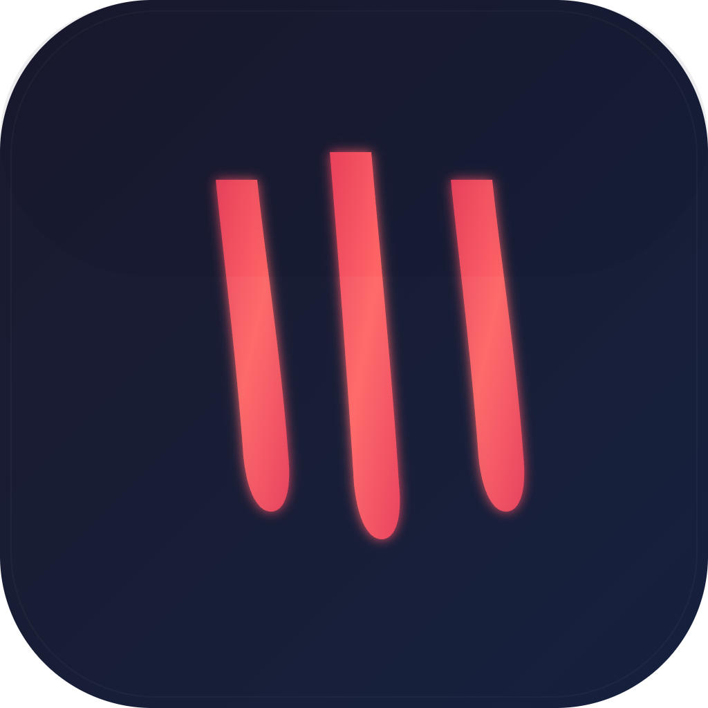

<div align="center">


# ClawUI

**OpenClaw 的桌面客户端 — 让你的 AI 助手拥有一个真正的控制台。**

[](https://github.com/SttFang/ClawUI/releases)
[](https://github.com/SttFang/ClawUI/actions)
[](LICENSE)
[](#-从源码构建)

**English** · [简体中文](docs/README_ZH.md) · [文档](https://docs.openclaw.ai) · [更新日志](CHANGELOG.md)

[官网](https://openclaw.ai) · [OpenClaw Gateway](https://github.com/openclaw/openclaw) · [反馈问题](https://github.com/SttFang/ClawUI/issues)

</div>

<!-- TODO: 产品截图 -->
<!-- <p align="center"></p> -->

---

## 概述

[OpenClaw](https://github.com/openclaw/openclaw) 是一个运行在本地的个人 AI 助手网关 — 多模型接入、多渠道消息路由、Agent 编排、工具执行、定时任务调度，全部在你的机器上完成。

**ClawUI** 是 OpenClaw 的官方桌面客户端。它把 OpenClaw 的全部能力封装为原生桌面应用，提供完整的可视化管理界面：从对话交互到 Agent 配置，从渠道路由到用量追踪，不再需要手动编辑 JSON 或盯着终端。

> 一句话：OpenClaw 是引擎，ClawUI 是仪表盘。

---

## 核心功能

### 🚀 简易安装

开箱即用的引导式安装流程。ClawUI 自动检测 OpenClaw 是否已安装、自动启动 Gateway、检测 Runtime 版本，全程无需手动配置。首次启动即进入 Onboarding 向导，几步完成从零到可用。

<!--  -->

### 💬 智能对话

流式消息渲染，内置 Shiki 语法高亮、LaTeX 数学公式、Mermaid 流程图。会话管理（创建、归档、切换），工作区文件侧边栏支持 PDF / DOCX / XLSX / 代码 / 图片预览。

<!--  -->

### 🛡️ 执行审批与 DAG 可视化

每一次 Agent 工具调用都需要用户明确授权 — 三种决策模式（允许 / 拒绝 / 修改）。执行完成后，完整调用链以交互式 DAG 图呈现，支持 Sub-Agent 多级工作流追踪。

<!--  -->

### 🤖 Agent 管理

一站式 Agent 控制面板，四个核心 Tab：

| Tab | 说明 |
|-----|------|
| Skills | 技能网络图，可视化 Agent 能力拓扑 |
| Channels | 消息渠道绑定与路由配置 |
| Nodes | 设备节点管理，多端协同 |
| Cron | 定时任务日历视图 |

支持多 Agent 切换，每个 Agent 独立维护会话历史与能力配置。

<!--  -->

### 📡 多渠道路由

在界面中配置 Telegram、Discord、WhatsApp、Slack、Signal 等消息渠道。同一个 AI 助手同时响应桌面与所有已接入平台，共享上下文与能力。

<!--  -->

### 📊 用量分析

内置 Token 用量与成本追踪：

- 每日趋势图 — 直观掌握消耗走势
- 成本拆分 — 按会话、按模型、按 Provider 多维度分析
- 会话时间线 — 定位异常消费

API 支出一目了然，不再需要自己算账。

<!--  -->

### ⏰ 定时任务

Cron 表达式驱动的定时任务调度，配合日历视图管理。Agent 可在指定时间自动执行任务，结果直接呈现在对话中。

### 🚑 Rescue Agent

内置排障专用会话，采用双 Gateway 架构隔离 — 即使主 Gateway 出现问题，Rescue Agent 仍可独立运行，诊断连接、配置错误与认证问题，辅助快速恢复。

### ⚙️ 设置中心

| 模块 | 说明 |
|------|------|
| 通用 | 语言（中文 / English）、主题（深色 / 浅色）、自动更新 |
| AI 服务 | Provider 认证（Anthropic OAuth Device Flow、OpenAI、自定义 API Key）、默认模型 |
| 消息渠道 | Bot Token、Webhook、路由策略、群组白名单 |
| 能力 | 工具、插件、技能、MCP Server 管理 |

---

## 架构

```
┌──────────────────────────────────────────────────────────────┐
│                      ClawUI (Electron)                       │
│                                                              │
│  ┌───────────────┐       ┌───────────────────────────────┐  │
│  │  Main Process  │       │      Renderer (React 19)      │  │
│  │                │       │                               │  │
│  │  Gateway 生命   │       │  对话 · Agent · 用量 · 设置    │  │
│  │  周期管理       │ ◄───► │  渠道 · 调度器 · Rescue       │  │
│  │  IPC 桥接      │       │                               │  │
│  │  自动更新       │       │  28 Zustand stores            │  │
│  │  RSA 设备认证   │       │  80+ React 组件               │  │
│  └───────┬────────┘       └───────────────────────────────┘  │
│          │                                                   │
└──────────┼───────────────────────────────────────────────────┘
           │ WebSocket (ACP 协议)
           ▼
┌────────────────────────────┐
│     OpenClaw Gateway       │
│     ws://127.0.0.1:18789   │
└──┬───┬───┬───┬───┬───┬─────┘
   │   │   │   │   │   │
   AI  TG  DC  WA  SK  Tools / Skills / Plugins / MCP
```

---

## 从源码构建

> 当前版本尚未上传预编译安装包，请通过源码构建。Release 下载将在后续版本提供。

**前置条件**：Node >= 22、pnpm、[OpenClaw](https://github.com/openclaw/openclaw) 已安装

```bash
git clone https://github.com/SttFang/ClawUI.git
cd ClawUI && pnpm install

pnpm build:mac       # macOS
pnpm build:win       # Windows
pnpm build:linux     # Linux
```

---

## 快速开始

```bash
# 1. 安装 OpenClaw
npm i -g openclaw@latest
openclaw onboard --install-daemon

# 2. 克隆并启动 ClawUI
git clone https://github.com/SttFang/ClawUI.git
cd ClawUI && pnpm install && pnpm dev
```

启动后 ClawUI 将自动检测 OpenClaw 安装、启动 Gateway 并建立 WebSocket 连接。Onboarding 向导会引导你完成首次配置。

---

## 技术栈

| 层级 | 技术 |
|------|------|
| 桌面框架 | Electron 33 + electron-vite |
| 前端 | React 19 + React Router 7 + Tailwind CSS 4 |
| UI 组件 | shadcn/ui（[@clawui/ui](packages/ui)） |
| 状态管理 | Zustand 5（28 stores） |
| 代码渲染 | Shiki 语法高亮 · LaTeX (KaTeX) · Mermaid |
| 流式渲染 | Streamdown（CJK / Code / Math / Mermaid） |
| 文件预览 | pdfjs-dist · docx-preview · ExcelJS |
| DAG 可视化 | React Flow + dagre 自动布局 |
| 图标 | Lucide React |
| 国际化 | i18next（中文 + English） |
| 日志 | electron-log v5（敏感数据脱敏） |
| 测试 | Vitest + Playwright |

---

## 参与贡献

欢迎提交 Issue 和 Pull Request。

```bash
pnpm install       # 安装依赖
pnpm dev           # 启动开发环境
pnpm lint          # 代码检查
bun run type-check # 类型检查
```

详见 [CONTRIBUTING.md](CONTRIBUTING.md)。

---

## 路线图

- [ ] 知识库管理（RAG 文档索引与检索）
- [ ] Agent 市场（社区共享 Agent 模板）
- [ ] MCP Server 市场
- [ ] 多窗口 / 多实例支持
- [ ] 移动端适配（响应式布局）
- [ ] 插件系统（自定义面板扩展）

---

## 许可证

[MIT](LICENSE) © [SttFang](https://github.com/SttFang)

---

<div align="center">

如果 ClawUI 对你有帮助，请给一个 ⭐ Star，这是对我们最大的支持。

[](https://star-history.com/#SttFang/ClawUI&Date)

</div>
